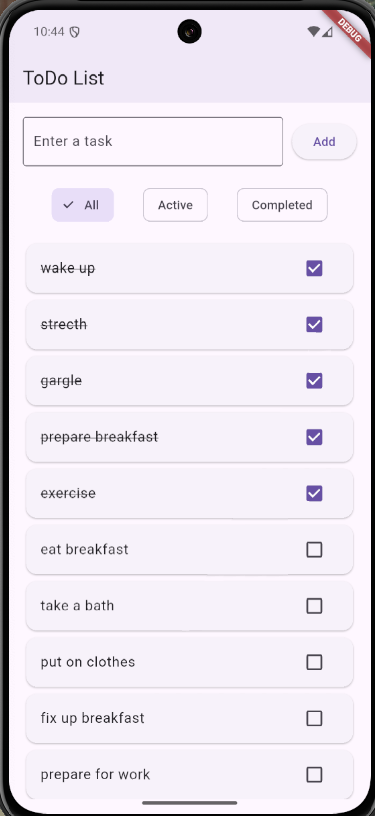
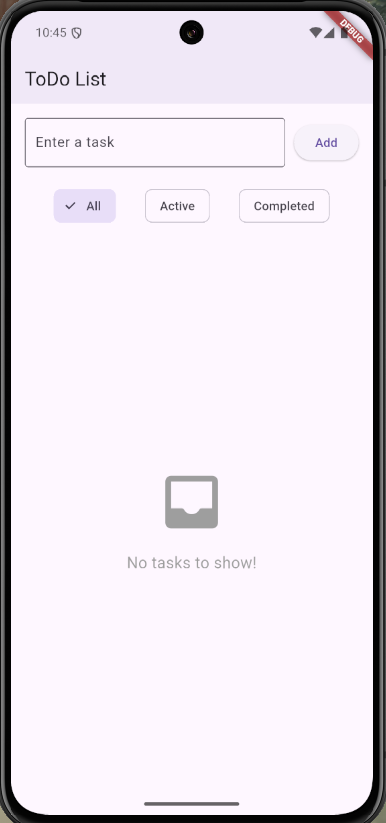

# ✅ ToDo App – Built with Flutter

A minimal and user-friendly mobile ToDo List app built using Flutter and Dart. This app demonstrates key Flutter development concepts such as dynamic UI rendering, local state management, animations, and data persistence with `shared_preferences`.

---

## 🚀 Features

- ✔ Add and delete tasks
- ✅ Mark tasks as completed with checkbox + strikethrough
- 🔍 Filter tasks by All, Active, or Completed
- 💾 Store tasks locally using `shared_preferences`
- 📭 Shows a friendly empty state message when no tasks exist
- 📦 APK ready for testing and sharing

---

## 📦 APK Download

You can install the app directly via the APK:

👉 [Download ToDo App APK](https://drive.google.com/file/d/1vDKR1cSgkq7_vVtg0VRKvmuNdd6Gt3LP/view?usp=drive_link)  
*(Replace the link above with your Google Drive shared APK link)*

---

## 📷 Screenshots

| Task List | Empty State |
|-----------|-------------|
|  |  |


---

## 🛠 Built With

- [Flutter](https://flutter.dev/)
- Dart
- `shared_preferences` – for saving tasks locally
- `flutter_native_splash` – for splash screen
- `flutter_launcher_icons` – for app icon customization

---

## 📁 Getting Started

To run locally:

```bash
git clone https://github.com/your-username/todo_app.git
cd todo_app
flutter pub get
flutter run
```

---

## 🙌 Author

**Guillermo V. Red, Jr., DIT**  
Assistant Professor IV – Bicol University 
📫 [GitHub](https://github.com/guired513)  
📧 gjvred@bicol-u.edu.ph

---

## 📜 License

This project is licensed under the [MIT License](LICENSE).
